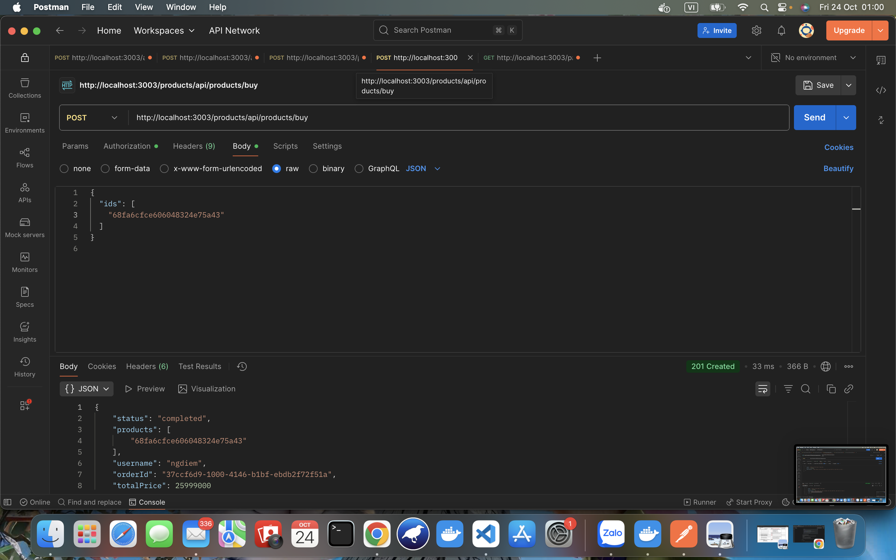
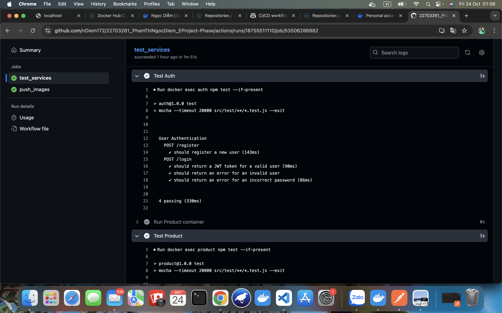

# EPROJECT-PHASE

## Download source code
git clone https://github.com/nDiem172/22703261_PhamThiNgocDiem_EProject-Phase.git

## 1. Hệ thống giải quyết vấn đề gì
- Hệ thống được xây dựng để mô phỏng một nền tảng thương mại điện tử có khả năng đăng ký, đăng nhập, quản lý sản phẩm, đặt hàng và thanh toán, được triển khai theo kiến trúc microservices.
- Mục tiêu là:
- Tách biệt chức năng từng phần (xác thực, sản phẩm, đơn hàng...).
- Dễ dàng mở rộng, bảo trì và triển khai độc lập.
- Tăng khả năng chịu tải và giao tiếp bất đồng bộ qua RabbitMQ.

## 2. Hệ thống có bao nhiêu dịch vụ
- Hệ thống được thiết kế theo kiến trúc microservices, gồm 4 dịch vụ chính(auth, product, order, api-gateway) và 2 dịch vụ hạ tầng (MongoDB, RabbitMQ).

## 3. Ý nghĩa từng dịch vụ
- Auth Service: quản lý người dùng như đăng ký, đăng nhập, xác thực bằng JWT.
- Product Service: quản lý danh sách sản phẩm, thêm sản phẩm vào giỏ, gửi yêu cầu đặt hàng.
- Order Service: Tiếp nhận đơn hàng từ Product Service, xử lý và lưu vào cơ sở dữ liệu.
- API Gateway: Cổng vào duy nhất của hệ thống. Tiếp nhận và định tuyến tất cả request từ client đến các microservice tương ứng.
- RabbitQM: Gửi và nhận thông điệp giữa các service theo cơ chế bất đồng bộ (event-driven).
- MongoDB: Lưu trữ dữ liệu cho từng service riêng biệt (AuthDB, ProductDB, OrderDB).

## 4. Các mẫu thiết kế được sử dụng
- Microservices Architecture
- API Gateway Pattern
- Event-Driven Pattern(message borker: RabbitMQ)
- Repository Pattern

## 5. Các dịch vụ giao tiếp như thế nào
- Client -> Api gateway (nhận request từ client và điều hướng đến các service) -> service(auth, product, order) 
- service(product) <-> service(order) (Giao tiếp bất đồng bộ qua RabbitMQ)
- service -> database (Mỗi service có MongoDB riêng để lưu dữ liệu của nó, giúp độc lập và tách biệt database)

## Kết quả:
### 1. POSTMAN: Tạo tài khoản người dùng

### 2. POSTMAN: Tiến hành đăng nhập thành công

### 3. POSTMAN: Tạo thông tin sản phẩm mới

### 4. POSTMAN: Thực hiện thao tác đặt hàng

### 5. POSTMAN: Thực hiện thao tác xem thông tin chi tiết sản phẩm

### 5. Kết quả chạy được trên docker

### 6. Github Action: Thực hiện CI/CD với dự án + CI/CD liên kết với Docker

